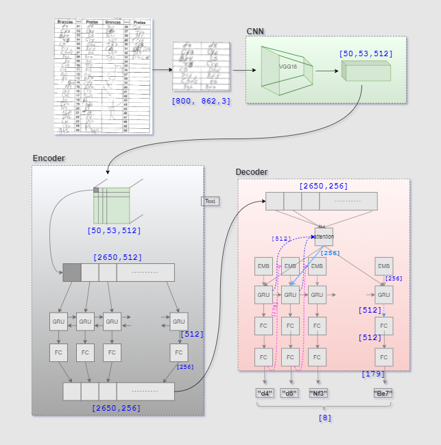
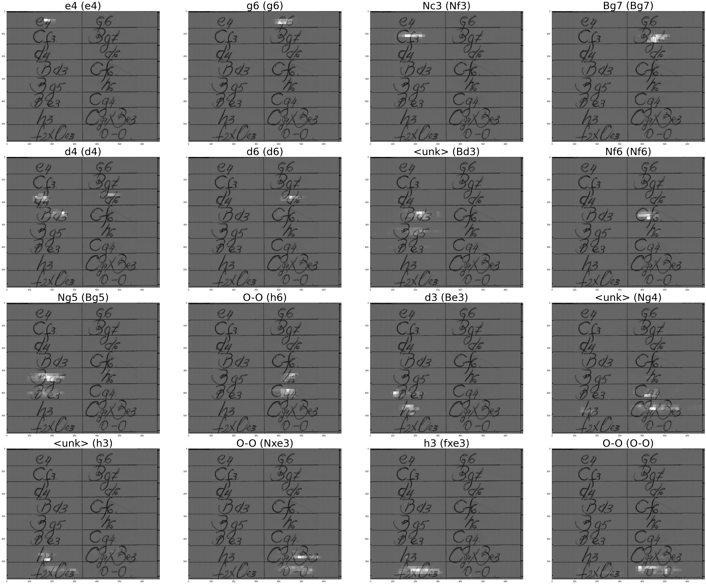
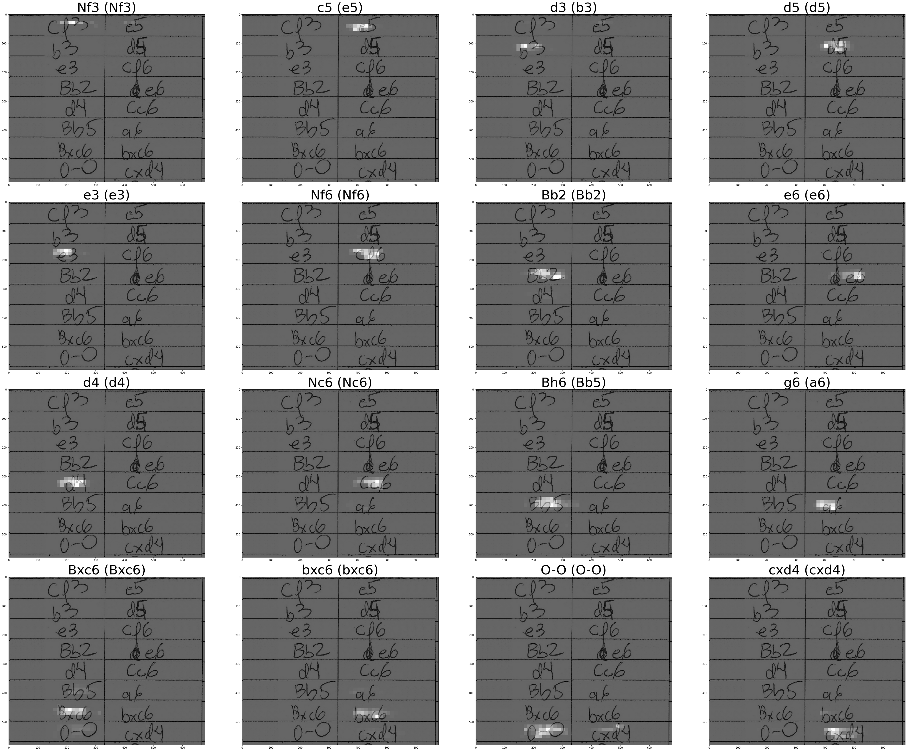
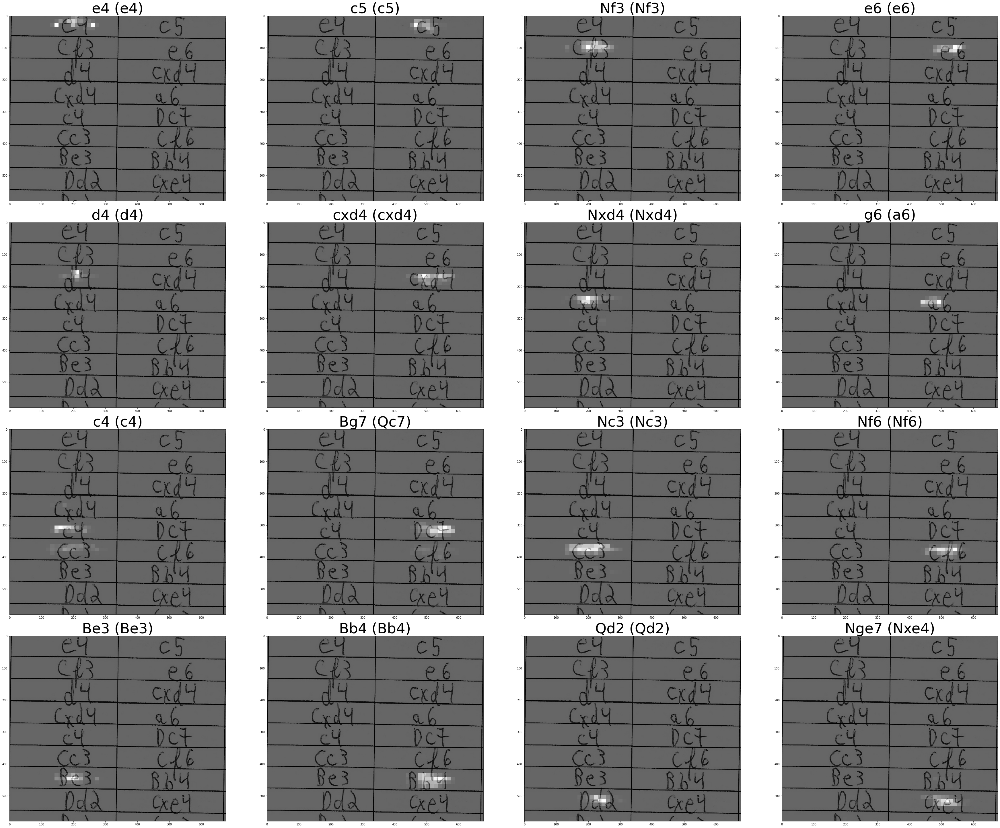
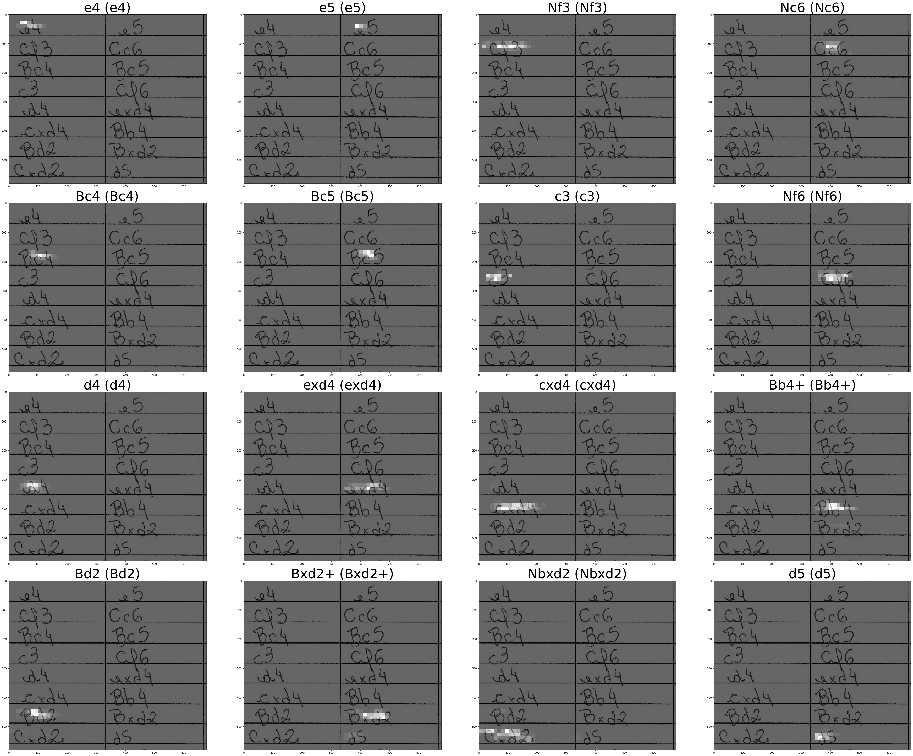

# Chess-Attention, Master Thesis, Hayashi-2021

This respository is part of my master thesis work.

`src/main_sample_training.py` contains a entry point to execute a sample training.

`notebooks/_sample_prediction.ipynb` contains example of a prediction code using sample data and a trained checkpoint.

`requirements.txt` contains the necessary python packages.
Execute pip install to install the packages.

The version of python used was 3.9.6.

**checkpoint:**
    This folder contains checkpoints resulting from the training of the model.
    These checkpoint can be used to do some prediction (see _sample_prediction.ipynb)

**data:**
    This folder contains some fixed data used by the model.

**dataset:**
    This folder contains training dataset. 
    Addicional dataset can be downloaded from https://drive.google.com/drive/folders/1PHTbbP-QrDKC4hjz55EHyredKVGBq4OZ?usp=sharing.

**dataset-builder**:
    This folder intention is for dataset building. All the necessary artefacts can be downloaded from 
        https://drive.google.com/drive/folders/1PHTbbP-QrDKC4hjz55EHyredKVGBq4OZ?usp=sharing.

**logs**:
    Contains log data of the training.

**docs:**
    Contains some documents.

**temp:**
    Temporary folder for training.


## Neural Network Architecture ##





## Example of a prediction notebook ##

```python
import sys
sys.path.append( '../src')
```


```python
from model_controller import ModelPredictController, ModelTrainController
from plotter import Plotter
from glob import glob
from IPython.display import Image
```

    Found GPU at: /device:GPU:0
    2.5.0
    Found GPU at: /device:GPU:0
    2.5.0
    Found GPU at: /device:GPU:0
    Found GPU at: /device:GPU:0
    2.5.0
    


```python
model = ModelPredictController(NUM_LINHAS=8, NO_TEACH=False);
```


```python
model.load()
```

    building...
    total do vocabulario=  179
    VOCAB_SIZE 180
    Shape da imagem ao final da CNN:  (None, 50, 53, 512)
    


```python
model.restoreFromCheckpointName('train_comparativo_20211106_handwritten_teacher_10k_---8linhas-handwritten--10k')
```

    restore from pretraining  ../checkpoints\train_comparativo_20211106_handwritten_teacher_10k_---8linhas-handwritten--10k\ckpt-2 ...
    


```python
from config import config
config["USE_BIG_PLOT"]= True
model.evaluateForTest('test-8lines-samples', plot_attention=True, _len= 16)
```

    target_len=  16
    evaluating dataset  test-8lines-samples
    evaluating total images:  4 ...
    evaluating  0 ...
    --------------------<  0 :  __scan1037.jpg >------------------------------
    len: 16 acc: 0.5 cer 0.6510416 file:  ../data/test-data/test-8lines-samples\images\__scan1037.jpg
    ../data/test-data/test-8lines-samples\images\__scan1037.jpg
    


    

    


    --------------------<  1 :  __scan1094.jpg >------------------------------
    len: 16 acc: 0.75 cer 0.13541667 file:  ../data/test-data/test-8lines-samples\images\__scan1094.jpg
    ../data/test-data/test-8lines-samples\images\__scan1094.jpg
    


    

    


    --------------------<  2 :  carnaval_0004_fullpage.jpg >------------------------------
    len: 16 acc: 0.8125 cer 0.10416667 file:  ../data/test-data/test-8lines-samples\images\carnaval_0004_fullpage.jpg
    ../data/test-data/test-8lines-samples\images\carnaval_0004_fullpage.jpg
    


    

    


    --------------------<  3 :  carnaval_0287_fullpage.jpg >------------------------------
    len: 16 acc: 1.0 cer 0.0 file:  ../data/test-data/test-8lines-samples\images\carnaval_0287_fullpage.jpg
    ../data/test-data/test-8lines-samples\images\carnaval_0287_fullpage.jpg
    


    

    


    [([1.0,
       0.875,
       0.75,
       0.8125,
       0.8500000238418579,
       0.875,
       0.8571428656578064,
       0.84375,
       0.8333333134651184,
       0.800000011920929,
       0.7727272510528564,
       0.7708333134651184,
       0.7692307829856873,
       0.7678571343421936,
       0.7666666507720947,
       0.765625],
      [0.0,
       0.0625,
       0.1111111119389534,
       0.0833333358168602,
       0.06666667014360428,
       0.0555555559694767,
       0.1071428656578064,
       0.109375,
       0.10648147761821747,
       0.15000000596046448,
       0.1666666716337204,
       0.1979166716337204,
       0.23076923191547394,
       0.232142835855484,
       0.2291666716337204,
       0.22265625],
      'test-8lines-samples')]


